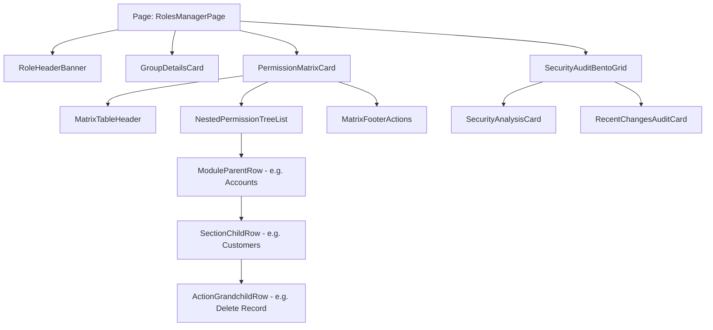

# Feature Specification: Admin Access Control List (ACL) - Roles & Permissions Manager

This document defines the architectural, UX/UI, design system, database schema, API data contract, and component implementation specification for the **Roles & Permissions Manager** (`/admin/roles-permissions/roles`) under the **Admin > Roles and Permissions** menu section.

---

## 1. Executive Summary & Design Reference

> [!NOTE]
> **Design Resource Source**: 
> `/Users/nbarrera/projects/Docker/blablaragsAndrip/documents/Design-Resources/Dashboard/Account-Group-Control/design/` (`DESIGN.md` & `code.html`)

The **Roles & Permissions Manager** provides administrative users with full oversight and granular control over system roles (`user_teams.title_key`) and permission matrices (`user_teams_privileges`). The feature follows the **Corporate Modern Minimalist Bento Grid** aesthetic, featuring a dual-column layout with an interactive tree-view permission matrix, group metadata editors, security audit cards, and real-time state feedback.

```
+---------------------------------------------------------------------------------------------------+
| HEADER NAVBAR: [Logo: Core Admin] Access Control Matrix                [Search...] [Bell] [Avatar]|
+---------------------------------------------------------------------------------------------------+
| BREADCRUMB / HERO SECTION                                                                         |
| Role Title: Engineering_Lead_Role [Edit Icon]            [Search user or group...]              |
| Subtitle: Modify group metadata and granular access rights for this systemic role.                |
+---------------------------------------------------------------------------------------------------+
| SECTION 1: GROUP DETAILS CARD                                                                     |
| +-----------------------------------------------------------------------------------------------+ |
| | Group Name: [Engineering_Lead_Role                      ] Description: [Senior engineers...] | |
| +-----------------------------------------------------------------------------------------------+ |
+---------------------------------------------------------------------------------------------------+
| SECTION 2: PERMISSION MATRIX CARD                                                                 |
| +-----------------------------------------------------------------------------------------------+ |
| | Header: Permission Matrix (Editing: Engineering_Lead_Role)          [Expand All] [Reset]     | |
| | +-------------------------------------------------------------------------------------------+ | |
| | | MODULE / ACTION                       | READ ACCESS               | WRITE / EDIT ACCESS       | | |
| | +-------------------------------------------------------------------------------------------+ | |
| | | [v] Accounts                          | [X] Checkbox              | [ ] Checkbox              | | |
| | |   |-- Customers                       | [X] Checkbox              | [X] Checkbox              | | |
| | |       |-- View Details                | [X] Checkbox              |                           | | |
| | |       |-- Edit Details                |                           | [X] Checkbox              | | |
| | |       |-- Delete Record               |                           | [X] Checkbox (Error Red)  | | |
| | | [v] Products                          | [X] Checkbox              | [ ] Checkbox              | | |
| | |   |-- Inventory                       | [X] Checkbox              | [X] Checkbox              | | |
| | +-------------------------------------------------------------------------------------------+ | |
| | Footer Note: Changes will take effect after user re-authenticates.  [Cancel] [Save Changes] | |
| +-----------------------------------------------------------------------------------------------+ |
+---------------------------------------------------------------------------------------------------+
| SECTION 3: SECURITY AUDIT BENTO GRID                                                              |
| +---------------------------------------------------------+ +-----------------------------------+ |
| | Security Analysis Card (Primary Container Tint)         | | Recent Changes Audit Log          | |
| | "Modify group metadata and granular access rights"     | | - Inventory Edit enabled (2h ago)| |
| | [Security Icon 48px]                                    | | - Group 'Auditors' created (1d) | |
| +---------------------------------------------------------+ +-----------------------------------+ |
+---------------------------------------------------------------------------------------------------+
```

---

## 2. Design System & Token Specifications

### 2.1. Color Tokens (`Core Admin` Palette)

| Design Token Key | Hex Code | Applied Role / Component |
|---|---|---|
| `primary` | `#004ac6` / `#2563eb` | Primary action buttons, active navigation indicator, checked checkboxes, focus rings |
| `primary-container` | `#2563eb` | Primary card background fill (Security Analysis card) |
| `on-primary-container` | `#eeefff` | Text color on primary container cards |
| `secondary-container` | `#d6e0f3` | Active menu background (`bg-secondary-container/30`), avatar badge background |
| `background` | `#f8f9fb` | Main canvas background |
| `surface` | `#f8f9fb` | Sidebar background, input fields background |
| `surface-bright` | `#f8f9fb` | Matrix card top header background |
| `surface-container-lowest` | `#ffffff` | Content cards background (Group Details, Permission Matrix) |
| `surface-container-low` | `#f3f4f6` | Matrix table header background (`bg-surface-container-low`), footer container background |
| `surface-container-high` | `#e7e8ea` | Audit log card background, button hover state |
| `outline-variant` | `#c3c6d7` / `#e5e7eb` | Card borders, table grid dividers, input borders |
| `on-surface` | `#191c1e` | Main page title, section headings, table text |
| `on-surface-variant` | `#434655` | Field label text, table subheaders, timestamps |
| `error` | `#ba1a1a` | Destructive checkboxes (e.g., `Delete Record`), error messages |

### 2.2. Typography Scale (`Inter` Font Family)

| Scale Key | Size / Line Height | Weight | Usage |
|---|---|---|---|
| `headline-lg` | 30px / 38px | 700 (Bold) | Role title heading (`Engineering_Lead_Role`) |
| `headline-md` | 20px / 28px | 600 (SemiBold) | Section card titles (`Group Details`, `Permission Matrix`) |
| `body-lg` | 16px / 24px | 500 (Medium) | Child module titles (`Customers`, `Inventory`) |
| `body-md` | 14px / 20px | 400 (Regular) | Action text (`View Details`, `Edit Details`), form inputs |
| `label-md` | 14px / 20px | 500 (Medium) | Field labels, breadcrumbs, nav item text |
| `label-sm` | 12px / 16px | 600 (SemiBold) | Table header columns, status pills, audit metadata |

### 2.3. Layout & Spacing Rules

- **Desktop (`>=1024px`)**:
  - Main container: 12-column grid (`max-w-[1440px] mx-auto`).
  - Sidebar: Fixed width 280px (`w-[280px]`).
  - Content padding: 32px (`p-margin-desktop`).
  - Security Bento Grid: 3-column split (`lg:col-span-2` Security card, `lg:col-span-1` Recent Changes card).
- **Mobile / Responsive (`<1024px`)**:
  - Sidebar collapses to slide-out drawer triggered by hamburger menu (`data-icon="menu"`).
  - Main content takes 100% width with 16px padding (`p-4`).
  - Security Bento Grid stacks vertically (`grid-cols-1`).

---

## 3. Backend Architecture & Database Contract (`server/`)

### 3.1. Database Tables & Seed Baseline

1. **`user_teams` Table** (`server/db/schema.sql`):
   ```sql
   CREATE TABLE IF NOT EXISTS user_teams (
     id        SERIAL PRIMARY KEY,
     user_id   INTEGER      NOT NULL REFERENCES users(id) ON DELETE CASCADE,
     title_key VARCHAR(64)  NOT NULL,
     href      TEXT,
     UNIQUE (user_id, title_key)
   );
   ```

2. **`user_teams_privileges` Table** (`server/db/schema.sql`):
   ```sql
   CREATE TABLE IF NOT EXISTS user_teams_privileges (
     id               SERIAL PRIMARY KEY,
     team_title_key   VARCHAR(64) NOT NULL,
     section_key      VARCHAR(64) NOT NULL,
     action_key       VARCHAR(64) NOT NULL,
     permission_scope VARCHAR(32) NOT NULL DEFAULT 'all',
     is_granted       BOOLEAN     NOT NULL DEFAULT true,
     UNIQUE (team_title_key, section_key, action_key)
   );
   ```

### 3.2. Domain Privilege Type Registry (`server/src/domain/privilege.types.ts`)

Extend `PrivilegeSectionActions` and `PRIVILEGES` registry:

```typescript
export interface PrivilegeSectionActions {
  customers: 'view' | 'delete';
  account_data: 'edit_customers';
  apparel: 'view' | 'edit' | 'verify';
  admin_roles: 'view' | 'edit' | 'delete'; // NEW: Admin ACL management
}

export const PRIVILEGES = {
  // ... existing privileges
  ADMIN_ROLES_VIEW: { section: 'admin_roles', action: 'view' },
  ADMIN_ROLES_EDIT: { section: 'admin_roles', action: 'edit' },
  ADMIN_ROLES_DELETE: { section: 'admin_roles', action: 'delete' },
} as const satisfies Record<string, Privilege>;
```

### 3.3. Migration (`server/db/migrations/0013_admin_roles_privileges.sql`)

```sql
-- Migration 0013: Admin Roles & Permissions ACL Privileges
INSERT INTO user_teams_privileges (team_title_key, section_key, action_key, permission_scope, is_granted)
VALUES
  ('Administrator', 'admin_roles', 'view', 'all', true),
  ('Administrator', 'admin_roles', 'edit', 'all', true),
  ('Administrator', 'admin_roles', 'delete', 'all', true),
  ('Customer-Service', 'admin_roles', 'view', 'all', true)
ON CONFLICT (team_title_key, section_key, action_key) DO NOTHING;
```

> [!IMPORTANT]
> **Hand-Fold Rule**: Per project guidelines, fold these `INSERT` statements into `server/db/schema.sql`'s baseline seed block and document the addition in `server/docs/database-entity-relaction.md`.

### 3.4. API Endpoints Specification (`server/src/routes/roles.ts`)

All endpoints build from `deps.config.adminPrefix` (`/api/admin`) and are gated via `requirePrivilege`:

1. **`GET /api/admin/roles`**: List all role groups with member counts and summary privileges.
   - Gated by: `PRIVILEGES.ADMIN_ROLES_VIEW`
   - Response:
     ```json
     {
       "success": true,
       "data": [
         {
           "titleKey": "Administrator",
           "description": "Full systemic access and user management",
           "memberCount": 3,
           "grantedActionsCount": 12
         },
         {
           "titleKey": "Customer-Service",
           "description": "Customer management and product moderation",
           "memberCount": 8,
           "grantedActionsCount": 6
         }
       ]
     }
     ```

2. **`GET /api/admin/roles/:roleKey`**: Get granular permission matrix for a specific role.
   - Gated by: `PRIVILEGES.ADMIN_ROLES_VIEW`
   - Response includes full module tree (Accounts, Apparel, Systems) with `isGranted` boolean for read/write actions.

3. **`PUT /api/admin/roles/:roleKey/permissions`**: Update granular permission matrix for a role group.
   - Gated by: `PRIVILEGES.ADMIN_ROLES_EDIT`
   - Request Body:
     ```json
     {
       "description": "Senior engineers with deployment access",
       "permissions": [
         { "sectionKey": "customers", "actionKey": "view", "isGranted": true },
         { "sectionKey": "customers", "actionKey": "delete", "isGranted": false },
         { "sectionKey": "apparel", "actionKey": "edit", "isGranted": true }
       ]
     }
     ```
   - Clears relevant Redis permission caches (`cache?.deletePattern('roles:*')`).

4. **`POST /api/admin/roles`**: Create a new custom role group.
   - Gated by: `PRIVILEGES.ADMIN_ROLES_EDIT`

5. **`DELETE /api/admin/roles/:roleKey`**: Remove custom role group.
   - Gated by: `PRIVILEGES.ADMIN_ROLES_DELETE`

---

## 4. Frontend Dashboard Integration (`dashboard/`)

### 4.1. Menu Navigation & Route Config (`dashboard/config/routes.ts`)

Add the subsection under Admin in `config/routes.ts`:

```typescript
{
  path: '/admin',
  name: 'admin',
  icon: 'crown',
  access: 'canAdmin',
  routes: [
    {
      path: '/admin/roles-permissions',
      name: 'rolesPermissions',
      icon: 'safetyCertificate',
      routes: [
        {
          path: '/admin/roles-permissions/roles',
          name: 'roles',
          component: './admin/roles-permissions/roles',
        },
      ],
    },
  ],
}
```

### 4.2. Access Control Gating (`dashboard/src/access.ts`)

Extend Umi's `access.ts` to support role-level menu visibility:

```typescript
export default function access(initialState: { currentUser?: API.CurrentUser } | undefined) {
  const { currentUser } = initialState ?? {};
  return {
    canAdmin: currentUser?.access === 'admin',
    canManageRoles: currentUser?.access === 'admin' || (currentUser?.privileges?.includes('admin_roles:view') ?? false),
  };
}
```

### 4.3. Internationalization (i18n) Registration

All visible text must be translated and registered in `en-US`, `de-DE`, and `es-ES`. Zero unlocalized strings or Chinese mock characters are permitted.

Keys to register (`src/locales/en-US/menu.ts` & `src/locales/en-US/pages.ts`):
- `menu.admin.rolesPermissions`: `"Roles & Permissions"`
- `menu.admin.rolesPermissions.roles`: `"Roles"`
- `pages.admin.roles.title`: `"Access Control Matrix"`
- `pages.admin.roles.groupDetails`: `"Group Details"`
- `pages.admin.roles.permissionMatrix`: `"Permission Matrix"`
- `pages.admin.roles.readAccess`: `"Read Access"`
- `pages.admin.roles.writeAccess`: `"Write / Edit Access"`
- `pages.admin.roles.saveChanges`: `"Save Changes"`
- `pages.admin.roles.cancelChanges`: `"Cancel Changes"`
- `pages.admin.roles.savedSuccess`: `"Saved Successfully"`

### 4.4. UI Component Architecture (`dashboard/src/pages/admin/roles-permissions/roles/`)



#### Component Specifications:

1. **`RoleHeaderBanner.tsx`**:
   - Displays current role title (`Engineering_Lead_Role`) with an inline edit affordance (`data-icon="edit"`).
   - Includes a real-time search input for filtering users or role groups.

2. **`GroupDetailsCard.tsx`**:
   - 2-column form grid (`Group Name`, `Description`).
   - Uses subtle outline focus rings (`focus:ring-2 focus:ring-primary`).

3. **`PermissionMatrixCard.tsx`**:
   - Header with `Editing: <roleKey>` pulse indicator badge and `Expand All` / `Reset to Default` actions.
   - 12-column Grid Table Layout:
     - `col-span-6`: Module / Section / Action name with tree-view indent guides (`subdirectory_arrow_right`, folder icons).
     - `col-span-3`: Read Access checkbox.
     - `col-span-3`: Write / Edit Access checkbox (styled red for sensitive operations like `Delete Record`).
   - Micro-interaction: Changing a checkbox highlights the `.permission-row` with a `2px solid #004ac6` left border indicator.

4. **`SecurityAuditBentoGrid.tsx`**:
   - Bento-box layout at bottom of canvas.
   - Left Card (2 cols): `Primary Container` fill (`#2563eb` tint) displaying security posture overview.
   - Right Card (1 col): Recent change timeline audit feed (e.g., *"Inventory Edit enabled 2h ago by Admin"*).

5. **`MatrixFooterActions.tsx`**:
   - `Cancel Changes` (Secondary outline button).
   - `Save Changes` (Primary button with animated `sync` spinner during save, transitioning to green `check_circle` on success).

---

## 5. Implementation Roadmap

### Phase 1: Server Domain & Database Layer
1. Add `admin_roles` to `PrivilegeSectionActions` and `PRIVILEGES` in `server/src/domain/privilege.types.ts`.
2. Create migration `0013_admin_roles_privileges.sql` and fold seeds into `server/db/schema.sql`.
3. Create `server/src/repositories/PgRoleRepository.ts` for role group & privilege CRUD operations.
4. Implement Fastify route handler `server/src/routes/roles.ts` under `adminPrefix` (`/api/admin/roles`).
5. Run server integration tests and verify `requirePrivilege` gating.

### Phase 2: Dashboard Service & i18n
1. Create `dashboard/src/services/roles.ts` with typed request calls to `/api/admin/roles`.
2. Add translation keys to `en-US`, `de-DE`, and `es-ES` locale files.
3. Update `config/routes.ts` and `src/access.ts` to register `Admin > Roles & Permissions -> Roles`.

### Phase 3: Dashboard UI Components & Page Integration
1. Build `GroupDetailsCard`, `PermissionMatrixCard`, `SecurityAuditBentoGrid`, and `MatrixFooterActions`.
2. Assemble `/admin/roles-permissions/roles/index.tsx` page using Ant Design Pro + Tailwind CSS.
3. Wire micro-interactions (checkbox left border highlight, button save feedback).

### Phase 4: Quality & Verification
1. Validate response handling in `requestErrorConfig.ts` (`success === false` handling).
2. Test Redis cache invalidation (`docker compose exec redis redis-cli flushall`).
3. Verify zero Chinese characters in localized UI (`grep -rIno "[一-鿿]" src/pages/admin`).
4. Validate containerized execution via `docker compose exec`.
