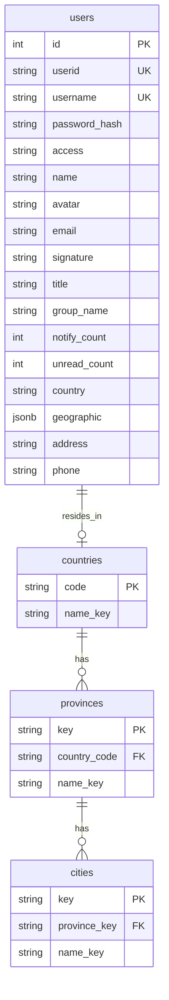

# Implementation Plan: Account Section Migration & Backend i18n

Migrate account settings and center endpoints from frontend Express mocks to PostgreSQL and Fastify backend, incorporating backend-driven internationalization (i18n) for responses, error messages, and geographic seed data across Spain, Germany, England, and Mexico.

## Goal
Establish robust database tables, repositories, routes, and tests in the backend server for all `/api/` endpoints related to user profiles, geographic listings (countries, provinces, cities), and fake lists, ensuring complete compatibility with the English, Spanish, and German locales.

---

## Proposed Database Schema & Seeds

To support the 4 target countries, we will introduce relational database tables for countries, provinces, and cities, populated with localized translation keys.



### Seed Data Definitions

We will seed the database with the following structure, using translation keys that map to dynamic translations (`en`, `es`, `de`) in our backend translation helper:

1. **Countries**:
   - `ES` -> `country.ES` (Spain / España / Spanien)
   - `DE` -> `country.DE` (Germany / Alemania / Deutschland)
   - `GB` -> `country.GB` (England / Inglaterra / England)
   - `MX` -> `country.MX` (Mexico / México / Mexiko)

2. **Provinces/States**:
   - Spain:
     - `ES-MD` -> `province.ES-MD` (Madrid)
     - `ES-CT` -> `province.ES-CT` (Catalonia / Cataluña / Katalonien)
     - `ES-AN` -> `province.ES-AN` (Andalusia / Andalucía / Andalusien)
   - Germany:
     - `DE-BE` -> `province.DE-BE` (Berlin)
     - `DE-BY` -> `province.DE-BY` (Bavaria / Baviera / Bayern)
     - `DE-HH` -> `province.DE-HH` (Hamburg)
   - England:
     - `GB-LND` -> `province.GB-LND` (Greater London / Gran Londres / London)
     - `GB-WMD` -> `province.GB-WMD` (West Midlands / Tierras Medias Occidentales / West Midlands)
     - `GB-NW` -> `province.GB-NW` (North West / Noroeste de Inglaterra / Nordwestengland)
   - Mexico:
     - `MX-CMX` -> `province.MX-CMX` (Ciudad de México / Ciudad de México / Mexiko-Stadt)
     - `MX-JAL` -> `province.MX-JAL` (Jalisco)
     - `MX-NLE` -> `province.MX-NLE` (Nuevo León)

3. **Cities**:
   - `ES-MD` -> `ES-MD-MAD` (Madrid)
   - `ES-CT` -> `ES-CT-BCN` (Barcelona)
   - `ES-AN` -> `ES-AN-SVQ` (Seville / Sevilla / Sevilla)
   - `DE-BE` -> `DE-BE-BER` (Berlin)
   - `DE-BY` -> `DE-BY-MUC` (Munich / Múnich / München)
   - `DE-HH` -> `DE-HH-HAM` (Hamburg)
   - `GB-LND` -> `GB-LND-LON` (London / Londres / London)
   - `GB-WMD` -> `GB-WMD-BHX` (Birmingham)
   - `GB-NW` -> `GB-NW-MAN` (Manchester)
   - `MX-CMX` -> `MX-CMX-MEX` (Ciudad de México / Ciudad de México / Mexiko-Stadt)
   - `MX-JAL` -> `MX-JAL-GDL` (Guadalajara)
   - `MX-NLE` -> `MX-NLE-MTY` (Monterrey)

---

## User Review Required

> [!IMPORTANT]
> Since the original mock dataset contains Chinese text (such as province names "浙江省", signatures, and project group names), we will translate or map them into English/neutral data to honor the project's zero-Chinese constraint.

> [!WARNING]
> Integrations tests will truncate database tables during test setup. Since tests run against the database, we need to ensure the new tables are safely truncated and re-seeded.

---

## Open Questions

> [!IMPORTANT]
> **Lightweight i18n implementation on Server:**
> Currently, the Fastify server has no i18n framework. We propose creating a simple, lightweight `I18nManager` utility class that:
> - Parses the incoming request's `Accept-Language` header (defaulting to `en`).
> - Retrieves matching translated strings for geographic names, user-facing responses, and error messages.
> *Does this simple approach satisfy your requirements, or would you prefer integrating a specific npm package like `i18next`?*

---

## Proposed Changes

### Database Setup & Schema Updates

#### [MODIFY] [schema.sql](file:///home/noel/projects/docker/Dashboard_Server/node-nginx-clean/server/db/schema.sql)
- Add `countries` table.
- Add `provinces` table.
- Add `cities` table.

#### [MODIFY] [fixtures.ts](file:///home/noel/projects/docker/Dashboard_Server/node-nginx-clean/server/db/fixtures.ts)
- Add geographic seeds (countries, provinces, cities).
- Define localized data for user profiles (signatures, group descriptions), tag labels, and project names in English, Spanish, and German.

#### [MODIFY] [seed.ts](file:///home/noel/projects/docker/Dashboard_Server/node-nginx-clean/server/db/seed.ts)
- Update truncation and insertion logic to populate new tables with the target country seeds.

#### [MODIFY] [reset.ts](file:///home/noel/projects/docker/Dashboard_Server/node-nginx-clean/server/db/reset.ts)
- Support resetting the new tables in all three reset modes.

---

### Backend Core & Repositories

#### [NEW] [i18n.ts](file:///home/noel/projects/docker/Dashboard_Server/node-nginx-clean/server/src/core/i18n.ts)
- Create a lightweight dictionary translation class that translates keys (e.g., `'error.unauthorized'`, `'country.ES'`, `'province.ES-MD'`, `'project.science_group'`) based on the request's locale (`en` | `es` | `de`).

#### [NEW] [PgGeographicRepository.ts](file:///home/noel/projects/docker/Dashboard_Server/node-nginx-clean/server/src/repositories/PgGeographicRepository.ts)
- Implement repository methods to query:
  - List of countries.
  - List of provinces, filtered by country.
  - List of cities, filtered by province.

#### [NEW] [PgAccountRepository.ts](file:///home/noel/projects/docker/Dashboard_Server/node-nginx-clean/server/src/repositories/PgAccountRepository.ts)
- Implement retrieval of the detailed user profile including teams/projects, and user article lists.

---

### Routes & Integration

#### [MODIFY] [auth.ts](file:///home/noel/projects/docker/Dashboard_Server/node-nginx-clean/server/src/routes/auth.ts)
- Add a centralized `app.decorate('authenticate', ...)` decorator/preHandler hook to validate session cookies in one place.
- Extend `authRoutes` to implement:
  - `GET /api/accountSettingCurrentUser` (gated with `authenticate`)
  - `GET /api/currentUserDetail` (gated with `authenticate`)
- Read the client locale from the `Accept-Language` header to return translated user profile data.

#### [MODIFY] [users.ts](file:///home/noel/projects/docker/Dashboard_Server/node-nginx-clean/server/src/routes/users.ts)
- Extend `userRoutes` to implement:
  - `GET /api/geographic/countries` (gated with `authenticate`)
  - `GET /api/geographic/province` (gated with `authenticate`, takes optional `country` query parameter)
  - `GET /api/geographic/city/:province` (gated with `authenticate`)
  - `GET /api/fake_list_Detail` (gated with `authenticate`)
- Return localized responses based on the request's locale.

#### [MODIFY] [app.ts](file:///home/noel/projects/docker/Dashboard_Server/node-nginx-clean/server/src/app.ts)
- Define and register the centralized `authenticate` decorator on the Fastify instance so it is available to all routes.
- Inject the new repository dependencies (geographic, detailed user profile/list data).

---

### Frontend Updates

#### [MODIFY] [service.ts](file:///home/noel/projects/docker/Dashboard_Server/node-nginx-clean/dashboard/src/pages/account/settings/service.ts)
- Add `queryCountries()` to retrieve countries.
- Update `queryProvince(country?: string)` to accept country selection.

#### [MODIFY] [base.tsx](file:///home/noel/projects/docker/Dashboard_Server/node-nginx-clean/dashboard/src/pages/account/settings/components/base.tsx)
- Retrieve country options dynamically via `queryCountries()`.
- Wrap the `province` ProFormSelect inside a `ProFormDependency` on `country`, passing the country value dynamically.
- Update validation messages to use localized keys if needed, or maintain consistency.

#### [MODIFY] [service.ts](file:///home/noel/projects/docker/Dashboard_Server/node-nginx-clean/dashboard/src/pages/account/center/service.ts)
- Ensure all service endpoint calls map cleanly through the backend Nginx proxy to the Fastify server.
- Clean up or delete the local frontend mock files `settings/_mock.ts` and `center/_mock.ts`.

---

## Verification Plan

### Automated Tests
- Run full integration test suite:
  ```bash
  docker compose run --rm server npm run test
  ```
- Write specific test cases verifying:
  - Language selection: Requesting with `Accept-Language: de` or `Accept-Language: es` translates signatures, titles, error responses, country, province, and city names.
  - Gated access: Unauthorized requests (no session cookie) return 401.

### Manual Verification
1. Rebuild and restart services:
   ```bash
   docker compose build && docker compose up -d
   ```
2. Navigate to the Account Center (`/account/center`) and Account Settings (`/account/settings`) pages in the browser.
3. Switch languages between English, German, and Spanish and ensure all dashboard profiles, lists, select dropdowns, and items reflect the correct translation without any errors or 404s.
